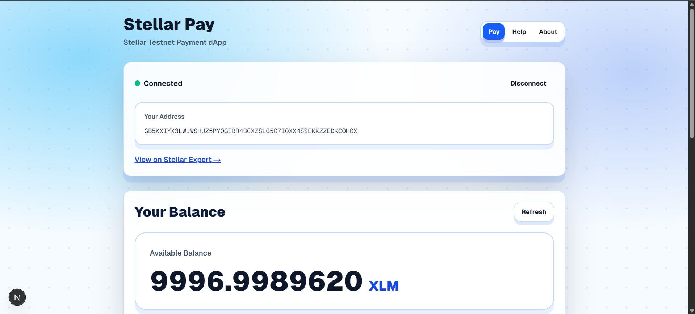
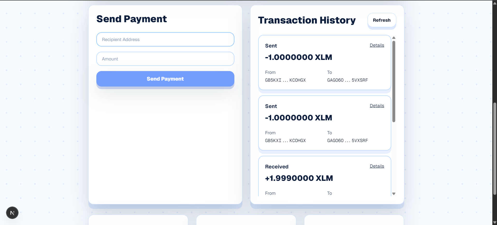
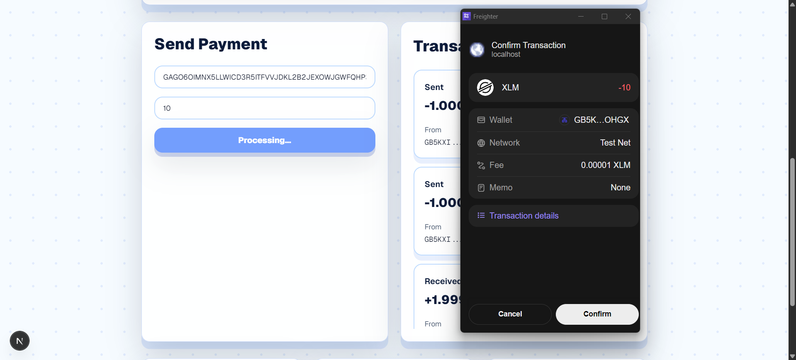
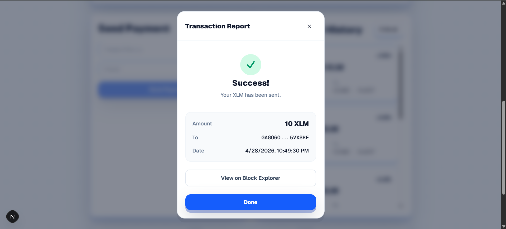

# Stellar Pay 🚀

A modern Stellar Testnet payment dApp built with Next.js, TypeScript, Tailwind CSS, Stellar SDK, and Freighter Wallet.

This project was developed for the **Stellar Level 1 – White Belt Challenge**.

---

# 📌 Project Description

Stellar Pay is a decentralized payment application that allows users to interact with the Stellar blockchain on the Testnet network.

The application enables users to:

- Connect their Freighter wallet
- View their XLM balance
- Send XLM transactions on Stellar Testnet
- View transaction history
- Receive transaction confirmation feedback

This project demonstrates the core fundamentals of Stellar development including wallet integration, blockchain balance fetching, transaction creation, signing, and submission.

---

# ✨ Features

## 🔐 Wallet Integration
- Connect Freighter Wallet
- Disconnect wallet
- Wallet connection state handling

---

## 💰 Balance Display
- Fetch real-time XLM balance
- Display available balance from Stellar Testnet

---

## 💸 Send XLM Transactions
- Send XLM to another Stellar address
- Freighter transaction signing
- Transaction validation and error handling

---

## 📜 Transaction History
- View recent transactions
- Display sent and received payments
- Open transactions in Stellar Explorer

---

## ✅ Transaction Feedback
- Success message after transaction completion
- Transaction hash display
- Explorer link for transaction verification

---

# 🛠 Tech Stack

| Technology | Purpose |
|---|---|
| Next.js | Frontend framework |
| TypeScript | Type safety |
| Tailwind CSS | UI styling |
| @stellar/stellar-sdk | Stellar blockchain interaction |
| @stellar/freighter-api | Wallet connection & signing |
| Horizon API | Blockchain data access |

---

# 🌐 Network Used

This application uses:

- Stellar Testnet
- Testnet Horizon API
- Freighter Wallet on Testnet

⚠️ This app is NOT configured for mainnet transactions.

---

# ⚙️ Setup Instructions

## 1. Clone Repository

```bash
git https://github.com/GityImran/Stellar-lvl-1
```

---

## 2. Open Project Folder

```bash
cd Stellar-lvl-1
```

---

## 3. Install Dependencies

```bash
npm install
```

---

## 4. Run Development Server

```bash
npm run dev
```

---

## 5. Open Application

Visit:

```txt
http://localhost:3000
```

---

# 🔑 Wallet Setup

This project requires the Freighter Wallet browser extension.

---

## Install Freighter Wallet

Install Freighter and create a wallet.

---

## Switch to Testnet

Inside Freighter:

```txt
Settings → Network → Testnet
```

---

## Fund Wallet

Use Stellar Friendbot to get free testnet XLM.

---

# 🚀 How to Use

## Step 1 — Connect Wallet

Click:

```txt
Connect Wallet
```

Approve the connection request in Freighter.

---

## Step 2 — View Balance

After connecting, your XLM balance will automatically load.

---

## Step 3 — Send XLM

Enter:

- recipient address
- amount

Then click:

```txt
Send Payment
```

Approve the transaction inside Freighter.

---

## Step 4 — Transaction Result

After a successful transaction:

- success message is displayed
- transaction hash is shown
- explorer link becomes available

---

# 📸 Screenshots

## 1. Wallet Connected State

Shows successful wallet connection and connected Stellar address.



---

## 2. History Displayed

Shows the fetched history of Stellar Testnet.



---

## 3. Successful Testnet Transaction

Shows transaction confirmation inside Freighter before submission.



---

## 4. Transaction Result Shown to User

Shows successful transaction feedback after transaction completion.



---

# 🔄 Transaction Flow

```txt
User Input
   ↓
Frontend Validation
   ↓
Build Stellar Transaction
   ↓
Freighter Signs Transaction
   ↓
Submit to Stellar Testnet
   ↓
Receive Transaction Confirmation
```

---

# 🔒 Security Notes

- Secret keys are never stored
- Transactions are signed inside Freighter
- Only public wallet addresses are handled in the frontend

---

# ❌ Common Errors

## Wallet Not Found

Cause:
- Freighter extension not installed

Fix:
- install Freighter
- refresh browser

---

## Invalid Address

Cause:
- incorrect Stellar public key

Fix:
- ensure address starts with `G`

---

## Insufficient Balance

Cause:
- sending more XLM than available

Fix:
- reduce transaction amount

---

# ✅ Challenge Requirements Covered

| Requirement | Status |
|---|---|
| Wallet setup | ✅ |
| Wallet connect/disconnect | ✅ |
| XLM balance display | ✅ |
| Send XLM transaction | ✅ |
| Transaction feedback | ✅ |
| Public GitHub repository | ✅ |
| Deployable application | ✅ |

---

# 🌍 Deployment

Recommended deployment platform:

- :contentReference[oaicite:1]{index=1}

---

# 👨‍💻 Author

Built by Imran for the Stellar White Belt Challenge.

---

# 📄 License

This project is open-source and created for educational purposes.